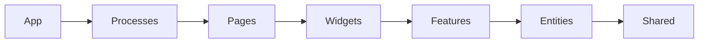
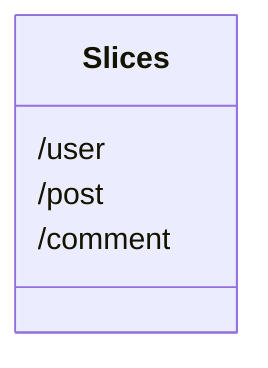
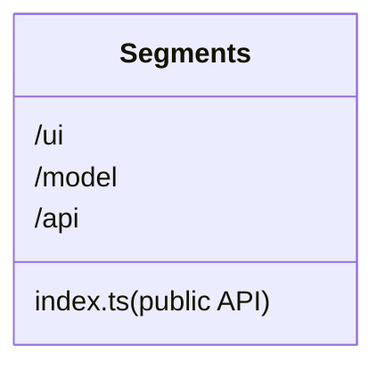

# Feature-sliced template

Feature-Sliced Design (FSD) is an architectural methodology for scaffolding front-end applications. Simply put, it's a compilation of rules and conventions on organizing code. The main purpose of this methodology is to make the project more understandable and structured in the face of ever-changing business requirements.

Main concept is in https://feature-sliced.design/en/

## Architecture overview

### Layers:

The first level of abstraction is according to the scope of influence

- app - initializing the application (init, styles, providers,...)
- processes - the business processes of the application control pages (payment, auth, ...)
- pages application page (user-page, ...)
- features - part of application functionality (auth-by-oauth, ...)
- entities - the business entity (viewer, order, ...)
- shared - reusable infrastructure code (UIKit, libs, API, ...)

### Slices

The second level of abstraction is according to the business domain

The rules by which the code is divided into slices depend on the specific project and its business rules and are not determined by the methodology

### Segments

The third level of abstraction is according to the purpose in the implementation

- ui - UI-representation of the module (components, widgets, canvas,...)
- model - business logic of the module (store, effects/actions, hooks/contracts,...)
- lib - auxiliary libraries
- api - the logic of interaction with the API
- config - the configuration module of the application and its environment

